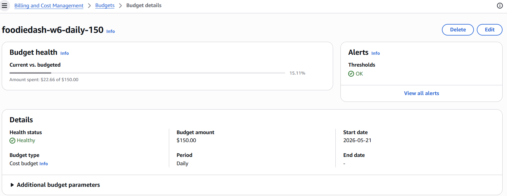
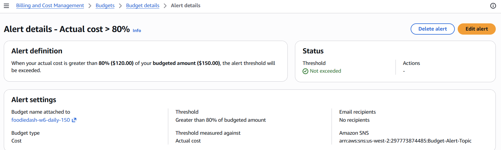
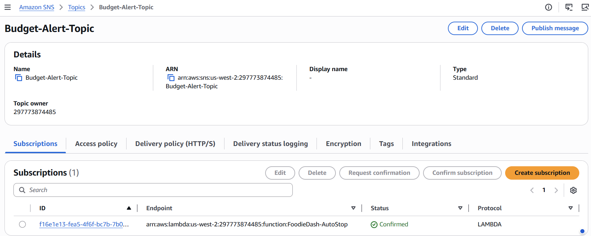
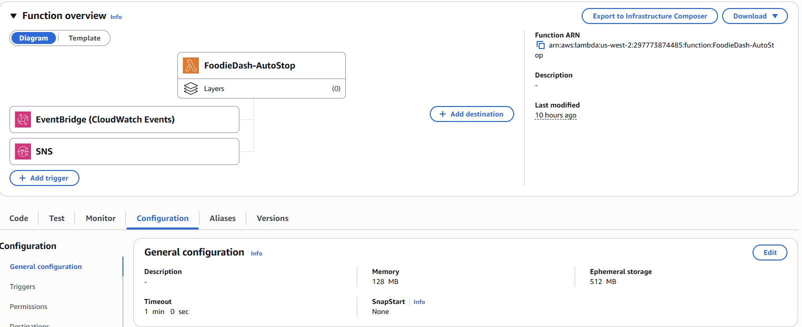
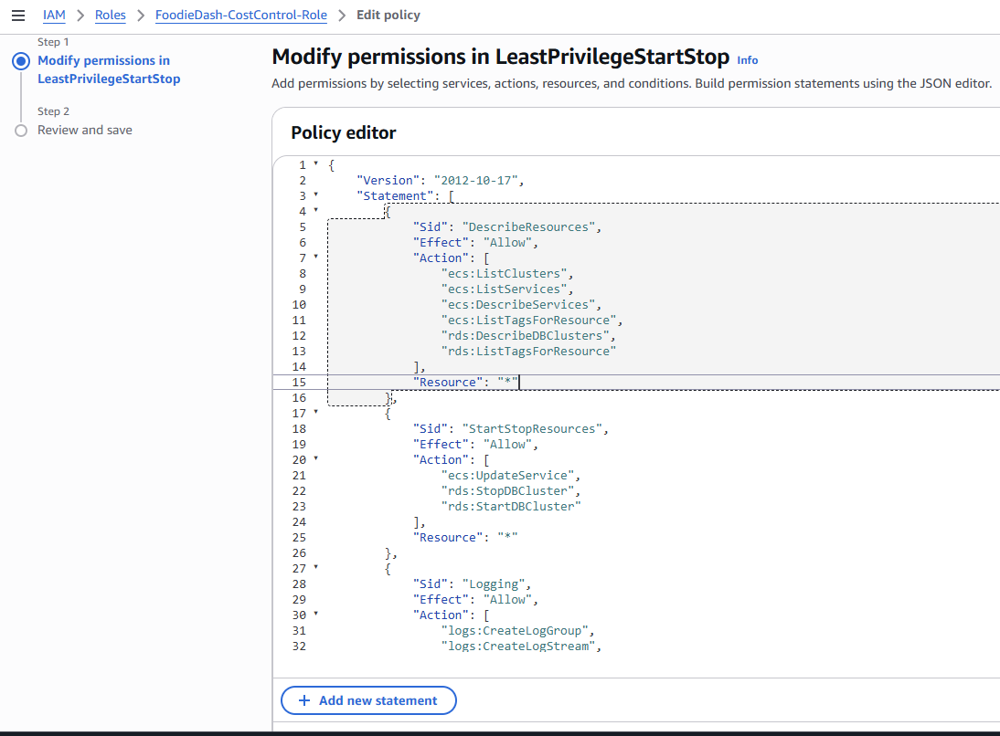
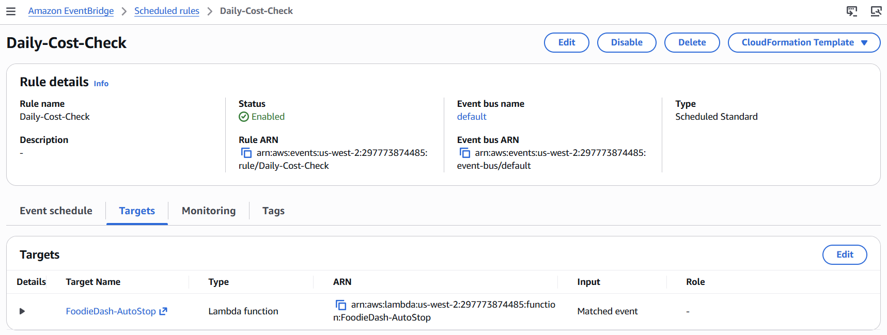
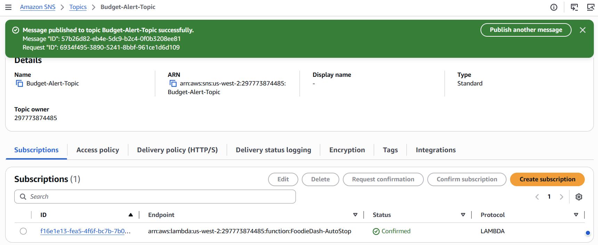
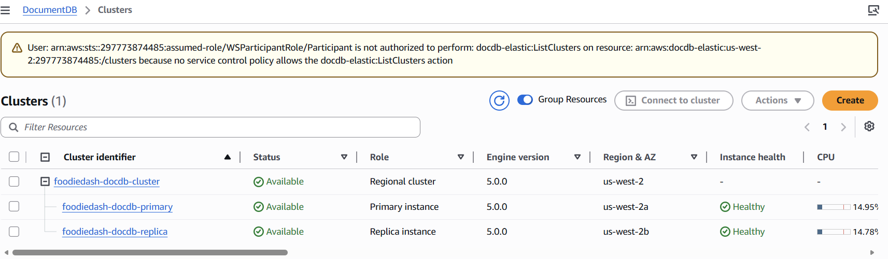
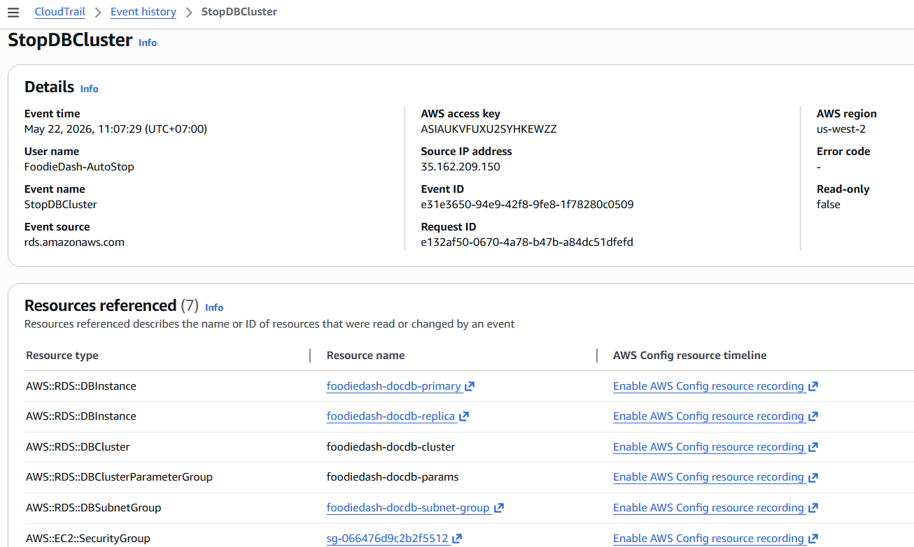
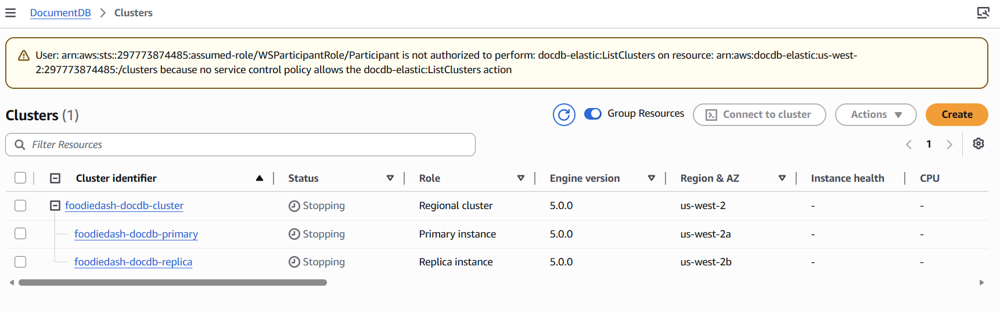

## Section 3 - MH-COST-A

### Component (d) - Cost-driven path

Verified against live workshop account `297773874485` on `2026-05-22`.

- Budget: `foodiedash-w6-daily-150`
- Budget type: `DAILY`, threshold path currently configured at `80% ACTUAL`
- SNS topic: `Budget-Alert-Topic`
- Lambda target: `FoodieDash-AutoStop`
- Lambda role: `FoodieDash-CostControl-Role`
- Scheduled safety net: EventBridge rule `Daily-Cost-Check`
- Current stop target visible in CloudTrail: `foodiedash-docdb-cluster`

1. **Budget configuration**
   
   - Caption: `AWS Budget 'foodiedash-w6-daily-150' is configured as a DAILY cost budget with a USD 150 limit for the workshop account. This is the budget used for the cost-driven stop path.`

2. **Budget notification to SNS**
   
   - Caption: `The budget notification is wired into an SNS-based automation path instead of an email-only path. This proves the budget can feed an action path, not just a human notification path.`

3. **SNS topic and confirmed Lambda subscription**
   
   - Caption: `SNS topic 'Budget-Alert-Topic' is the routing layer between AWS Budgets and the stop Lambda. The confirmed Lambda subscription to 'FoodieDash-AutoStop' proves that a budget message can invoke the stop automation directly.`

4. **Lambda deployed**
   
   - Caption: `Lambda 'FoodieDash-AutoStop' is deployed and active in the live workshop account. It is the common execution target for both the budget-driven SNS path and the daily EventBridge safety-net path.`

5. **Least-privilege role**
   
   - Caption: `Execution role 'FoodieDash-CostControl-Role' uses inline policy 'LeastPrivilegeStartStop'. In the live account this policy is scoped to describe ECS and RDS resources and to perform only the start/stop actions needed by the cost guard.`

6. **Scheduled safety-net path**
   
   - Caption: `EventBridge rule 'Daily-Cost-Check' provides the required daily scheduled mechanism. Its target is the same Lambda 'FoodieDash-AutoStop', so both the scheduled path and the budget-driven path converge on one stop function.`

7. **Test SNS publish**
   
   - Caption: `A test message is published to 'Budget-Alert-Topic' to simulate the budget event. This is the approved workshop demo method because real AWS cost data typically arrives too late for a 48-hour account window.`

8. **Before state of stop target**
   
   - Caption: `Before state for the stop target. The team uses 'foodiedash-docdb-cluster' as the demonstrable billable resource for the cost-driven stop path because CloudTrail in this account already shows 'FoodieDash-AutoStop' issuing StopDBCluster against it.`

9. **CloudTrail proof**
   
   - Caption: `CloudTrail confirms the automation path executed a real control-plane stop action. In the live account, Lambda 'FoodieDash-AutoStop' invoked 'StopDBCluster' on 'foodiedash-docdb-cluster', which is the strongest evidence that the chain performs a real billable-resource stop and is not just a notification.`

10. **After state of stop target**
   
   - Caption: `After state for 'foodiedash-docdb-cluster' following the Lambda-driven stop action. Together with the before screenshot and the CloudTrail event, this completes the demonstrated stop evidence required by MH-COST-A.`

#### ADR - cost data latency

**ADR: Budget-driven stop path in a short-lived workshop account**

AWS Budgets cost data is delayed by roughly `8-24 hours`, so the real budget threshold is not expected to fire reliably inside a `48-hour` workshop account even when the wiring is correct. Because of that latency, the team validates the chain by publishing a test message to SNS topic `Budget-Alert-Topic`, which exercises the same downstream path used by the real budget notification. In production, the daily EventBridge rule `Daily-Cost-Check` acts as the guaranteed safety-net path, while the budget-driven SNS path provides an additional reactive layer when spend approaches the configured threshold.
