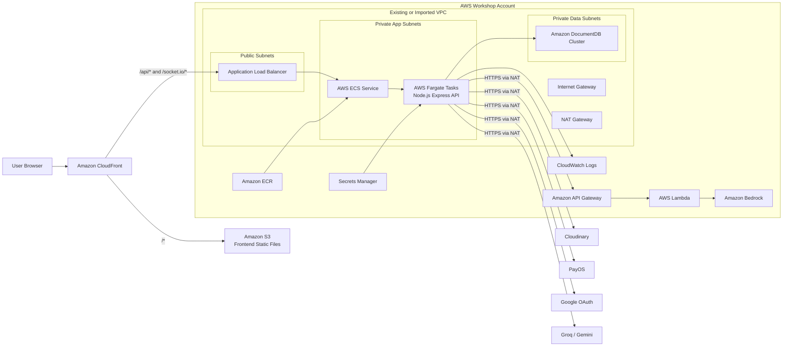
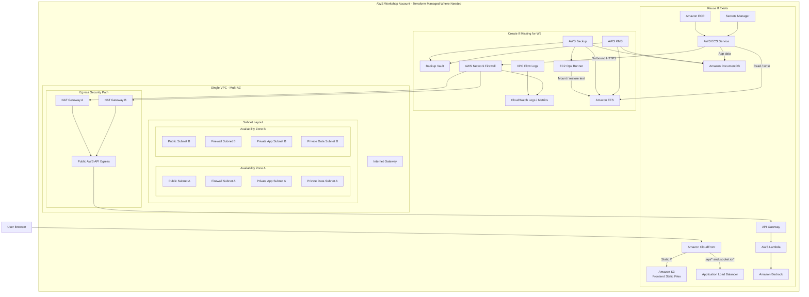

# W5 Terraform-First AWS Workshop Plan cho XOPS

## Tóm tắt
- Dùng `Terraform` làm cách triển khai chính cho tuần này thay vì tạo service thủ công trên AWS Console.
- Terraform dùng temporary AWS CLI credentials lấy từ `AWS Workshop Studio`, mặc định region `us-west-2`.
- Vì đây là `shared workshop account`, Terraform phải ưu tiên `reuse resource đã có` bằng `data sources`, `terraform.tfvars`, hoặc import có kiểm soát; chỉ tạo service mới khi thật sự thiếu.
- State dùng `local Terraform state` trong workspace tuần này để tránh phụ thuộc quyền tạo S3 backend/DynamoDB lock trong account workshop.
- Vẫn giữ mục tiêu W5: `single VPC multi-AZ`, Flow Logs, Network Firewall, EFS, EC2 ops-runner, AWS Backup, API Gateway hardening, Lambda provisioned concurrency, và evidence cho từng MH.

## Terraform Access Setup
Terraform không đăng nhập AWS Console trực tiếp. Terraform gọi AWS API bằng temporary credentials do AWS Workshop Studio cấp.

1. Trong Workshop Studio, mở `AWS account access` -> `Get AWS CLI credentials`.
2. Chọn tab `Windows (PowerShell)`.
3. Copy các biến môi trường vào terminal PowerShell:

```powershell
$Env:AWS_DEFAULT_REGION="us-west-2"
$Env:AWS_ACCESS_KEY_ID="<workshop-access-key>"
$Env:AWS_SECRET_ACCESS_KEY="<workshop-secret-key>"
$Env:AWS_SESSION_TOKEN="<workshop-session-token>"
```

4. Kiểm tra session trước khi chạy Terraform:

```powershell
aws sts get-caller-identity
aws configure get region
```

5. Nếu credentials hết hạn, quay lại Workshop Studio copy lại credentials mới rồi chạy lại `terraform plan`.

## Terraform Strategy for Shared Workshop Account
Provider mặc định:

```hcl
provider "aws" {
  region = "us-west-2"
}
```

Các nguyên tắc triển khai:
- Dùng `terraform.tfvars` để khai báo `project = "xops"`, `environment = "workshop"`, region, tag chuẩn, và các ID resource có sẵn nếu cần.
- Dùng `data` sources để lookup resource đã tồn tại theo `tag`, `name`, hoặc explicit ID trước khi tạo mới.
- Dùng biến kiểu `create_*` hoặc kiểm tra `*_id` input để điều khiển conditional creation.
- Không hard-delete, replace, hoặc recreate resource chung nếu resource đó không chắc chắn thuộc project.
- Trước mỗi lần apply, bắt buộc đọc kỹ `terraform plan`; plan hợp lệ không được có `destroy` hoặc `replace` trên resource dùng chung.
- Chỉ dùng `terraform import` khi team muốn Terraform quản lý sâu resource đã có. Nếu chỉ cần tham chiếu, ưu tiên `data source`.

Ví dụ `terraform.tfvars`:

```hcl
aws_region  = "us-west-2"
project     = "xops"
environment = "workshop"

# Điền khi workshop account đã có resource phù hợp.
existing_vpc_id         = ""
existing_ecs_cluster_id = ""
existing_alb_arn        = ""
existing_docdb_arn      = ""

# Chỉ bật tạo mới khi discovery xác nhận chưa có.
create_vpc              = false
create_network_firewall = true
create_efs              = true
create_ops_runner       = true
create_backup_plan      = true
```

## Current State Diagram


## Target W5 Diagram


## AWS Services trong Terraform Plan

### Reuse if exists
- `Amazon VPC`: network boundary chính, ưu tiên lookup VPC hiện có bằng ID/tag.
- `Public/Private Subnets`: reuse subnets multi-AZ nếu đã có layout phù hợp.
- `Security Groups`: reuse SG của ALB, ECS, DocumentDB, Lambda nếu rule hiện tại đúng.
- `Amazon S3`: host frontend build.
- `Amazon CloudFront`: edge distribution cho FE và reverse proxy `/api/*`, `/socket.io/*`.
- `Application Load Balancer`: entry point cho backend Express.
- `Amazon ECS` và `AWS Fargate`: backend service/task runtime.
- `Amazon ECR`: image registry cho backend container.
- `AWS Secrets Manager`: inject secret/env vào task definition.
- `Amazon DocumentDB`: database chính của ứng dụng.
- `Amazon API Gateway`: surface API chính thức trước Lambda.
- `AWS Lambda`: xử lý RAG serverless.
- `Amazon Bedrock`: AI model/runtime cho Lambda.

### Create if missing for W5
- `VPC Flow Logs`: bắt buộc cho MH1, gửi log về CloudWatch.
- `AWS Network Firewall`: bắt buộc cho MH2 vì private outbound đi qua NAT Gateway.
- `Firewall Subnets A/B`: tạo nếu VPC hiện tại chưa có subnet dành cho firewall endpoint.
- `NAT Gateway A/B`: reuse nếu đã có; tạo gateway còn thiếu nếu cần đúng multi-AZ.
- `Amazon CloudWatch Logs/Metrics`: log group cho Flow Logs, Firewall logs, ECS, Lambda metrics nếu thiếu.
- `AWS KMS`: key mã hóa cho EFS, DocumentDB, Backup Vault nếu chưa có key project phù hợp.
- `Amazon EFS`: shared file storage cho app tier.
- `Amazon EC2`: `ops-runner` private Linux để mount EFS và demo restore.
- `Amazon EBS`: encrypted volume gắn cho `ops-runner`, cũng là resource backup.
- `AWS Backup`: backup plan, backup vault, backup selections cho `EFS + EBS + DocumentDB`.
- `API Gateway API Key + Usage Plan`: hardening cho MH4 nếu API Gateway đã có nhưng chưa bật key.
- `Lambda Provisioned Concurrency`: tối ưu MH5 cho Lambda RAG.

### Do not recreate
- `Amazon Bedrock model access`: không tạo lại bằng Terraform; dùng cấu hình workshop/account đã cấp.
- Workshop account-level IAM/config đã có sẵn.
- Resource chung không có tag/name liên quan `xops` hoặc không chắc thuộc project.
- Existing CloudFront/S3/ECS/DocumentDB đang chạy production demo, trừ khi Terraform plan chỉ update đúng phần đã chốt.

## Terraform Modules / Structure
Đề xuất cấu trúc repo nếu triển khai Terraform ngay trong tuần này:

```text
terraform/
  providers.tf
  variables.tf
  terraform.tfvars.example
  data.tf
  network.tf
  storage.tf
  compute.tf
  backup.tf
  api.tf
  outputs.tf
```

- `providers.tf`: AWS provider, region `us-west-2`, default tags.
- `variables.tf`: `project`, `environment`, `aws_region`, reuse IDs, create flags.
- `terraform.tfvars.example`: template để team điền resource ID từ workshop account.
- `data.tf`: lookup VPC, subnets, SGs, ECR, S3, CloudFront, ECS, ALB, DocumentDB, Lambda, API Gateway.
- `network.tf`: Flow Logs, Network Firewall, firewall subnets/routing nếu cần.
- `storage.tf`: EFS, mount targets, KMS key/alias nếu thiếu.
- `compute.tf`: ECS task definition update để mount EFS, EC2 ops-runner private subnet, encrypted EBS.
- `backup.tf`: AWS Backup vault, plan, selections, IAM role.
- `api.tf`: API Gateway API key/usage plan, Lambda provisioned concurrency.
- `outputs.tf`: CloudFront URL, ALB DNS, API Gateway endpoint, EFS ID, Backup vault/plan IDs, Flow Logs log group, Firewall ARN.

Nếu tuần này chỉ cần tài liệu/evidence, chưa bắt buộc tạo toàn bộ file Terraform. Tuy nhiên mọi thay đổi AWS thật phải đi theo workflow Terraform dưới đây.

## Interface và thay đổi triển khai cần chốt
- Backend thêm env/secrets: `RAG_API_URL`, `RAG_API_KEY`, `AWS_REGION`, `EFS_SHARED_PATH`.
- ECS task definition thêm `EFS volume` mount vào backend container khi `create_efs = true` hoặc `existing_efs_id` được cung cấp.
- API Gateway thêm `API Key` và `Usage Plan`; backend gửi `x-api-key` khi gọi RAG endpoint.
- Lambda RAG bật `Provisioned Concurrency`; không đổi contract request/response với backend.
- DocumentDB giữ vai trò DB chính; backup/restore DB tuần này bám trực tiếp trên DocumentDB cluster đang dùng thật.

## Terraform Deployment Workflow
1. Export workshop AWS credentials trong PowerShell.
2. Chạy `aws sts get-caller-identity` để xác nhận account/session.
3. Chạy discovery bằng AWS CLI và Terraform `data` sources để xác định resource nào đã có.
4. Điền `terraform.tfvars` với `us-west-2`, project tags, create flags, và ID resource có sẵn nếu cần.
5. Chạy `terraform init`.
6. Chạy `terraform plan`.
7. Kiểm tra kỹ plan:
   - Không có `destroy`.
   - Không có `replace` trên resource dùng chung.
   - Không tạo trùng VPC, ECS, ALB, S3, CloudFront, DocumentDB, Lambda, API Gateway nếu đã tồn tại.
8. Chỉ chạy `terraform apply` khi plan chỉ tạo mới phần W5 còn thiếu hoặc update đúng resource project đã chốt.
9. Sau apply, lấy `terraform output` cho CloudFront, ALB, API Gateway, EFS, Backup, Flow Logs, Firewall.
10. Cập nhật `docs/W5_evidence.md` bằng outputs, AWS console screenshots, CloudWatch logs/metrics, và kết quả test.

## Suggested Discovery Commands
Chạy các lệnh này trước khi quyết định `create_* = true`:

```powershell
aws ec2 describe-vpcs --region us-west-2
aws ec2 describe-subnets --region us-west-2
aws ecs list-clusters --region us-west-2
aws ecr describe-repositories --region us-west-2
aws elbv2 describe-load-balancers --region us-west-2
aws docdb describe-db-clusters --region us-west-2
aws lambda list-functions --region us-west-2
aws apigateway get-rest-apis --region us-west-2
aws s3api list-buckets
aws cloudfront list-distributions
```

Kết quả discovery phải được chuyển thành `data` source hoặc explicit ID trong `terraform.tfvars`, không tạo trùng service.

## Test và acceptance
- `terraform plan` không có hành động `destroy` hoặc `replace` resource dùng chung.
- Resource có sẵn được Terraform đọc qua `data` source hoặc ID trong `terraform.tfvars`, không tạo trùng.
- Nếu service chưa có, Terraform tạo đúng phần thiếu cho W5: Flow Logs, Network Firewall, EFS, EC2 ops-runner, Backup plan/vault, API Gateway usage plan/API key, Lambda provisioned concurrency.
- `MH1`: Flow Logs có sample `ACCEPT/REJECT`; sơ đồ giải thích rõ vì sao vẫn dùng `single VPC`.
- `MH2`: có 1 request bị chặn trong Firewall Alert Logs và 1 request hợp lệ đi qua NAT.
- `MH3`: ECS hoặc EC2 ghi/đọc file thật từ EFS; backup jobs `Completed` cho `EFS + EBS + DocumentDB`; restore đọc lại được data đã biết.
- `MH4`: request có `x-api-key` trả `200`; thiếu key trả `403`.
- `MH5`: metric Lambda thể hiện cold start giảm sau khi bật provisioned concurrency.
- `Carry-forward`: FE load qua CloudFront, backend đi qua ALB, chat end-to-end vẫn chạy.

## Assumptions
- Region mặc định là `us-west-2` vì Workshop Studio đang cấp console/credentials cho region này.
- Terraform state dùng local state trong workspace tuần này.
- Reuse strategy mặc định là `data source first`; chỉ import resource nếu cần Terraform quản lý sâu resource đó.
- Account workshop có thể đã configure sẵn một phần service, nên mọi bước tạo mới phải đi sau discovery và kiểm tra `terraform plan`.
- FE chính thức được trình bày là `S3 + CloudFront`.
- DB chính hiện đã migrate sang `Amazon DocumentDB`, nên DocumentDB phải xuất hiện trong cả `Current State` và `Target W5` diagram.
- Nếu console hiện tại chỉ có `1 NAT Gateway`, W5 target nên nâng lên `2 NAT Gateway` để đúng multi-AZ; nếu team không kịp, ghi rõ trade-off trong evidence.
